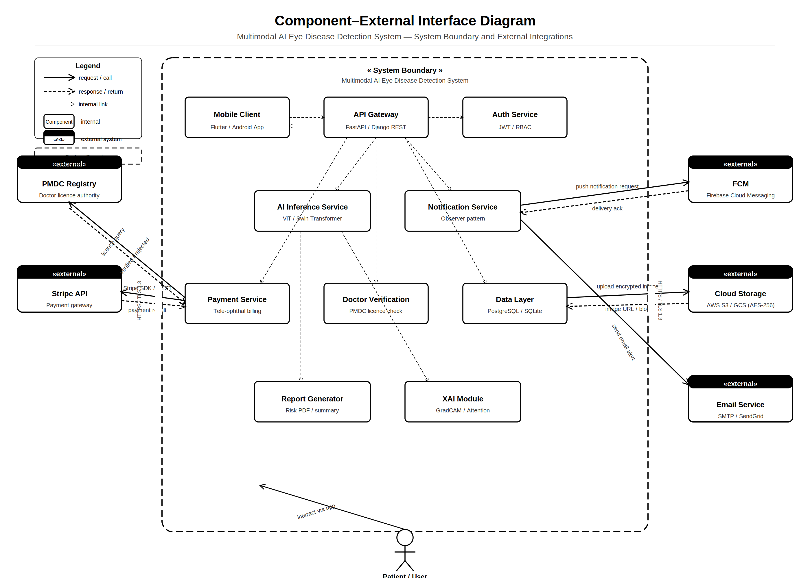
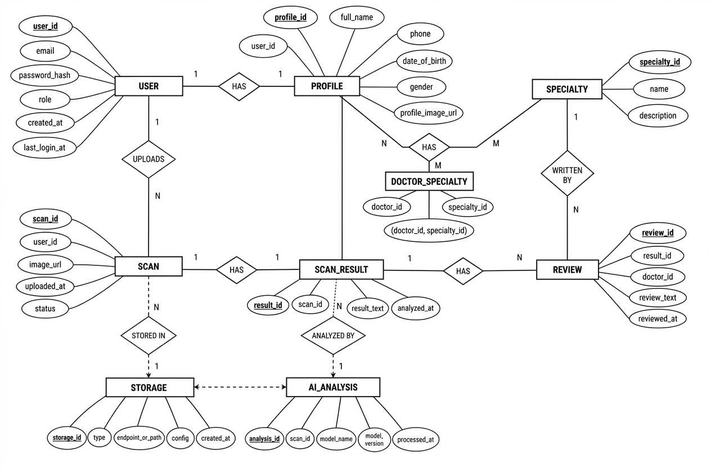
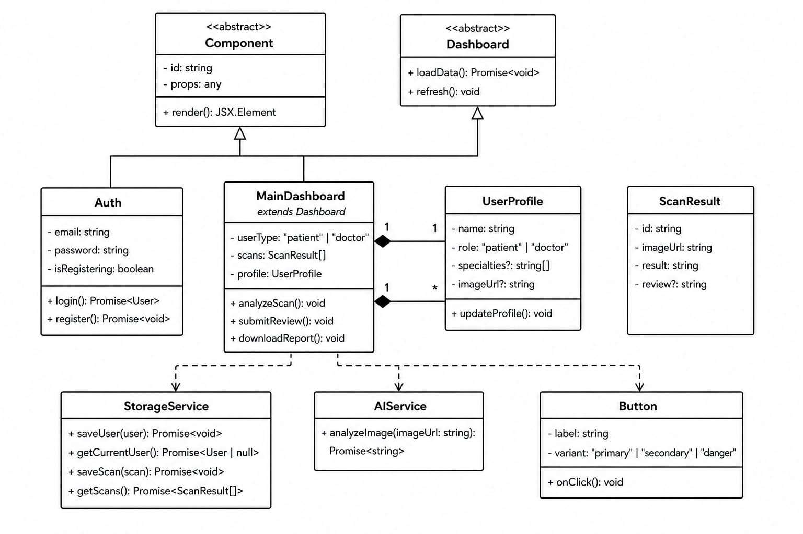
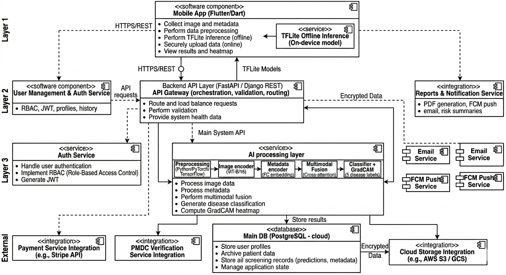

# Multimodal-AI-for-Early-Detection-and-Prevention-of-Eye-Diseases-in-South-Asian-Populations-Project-
> A mobile-first, AI-powered platform for early detection of ocular diseases using multimodal deep learning, explainable AI (XAI), and tele-ophthalmology.

---

## 📌 Table of Contents

- [Overview](#overview)
- [Key Features](#key-features)
- [Technology Stack](#technology-stack)
- [System Architecture](#system-architecture)
- [AI Pipeline](#ai-pipeline)
- [Database Design](#database-design)
- [User Flow](#user-flow)
- [Diagrams](#diagrams)
- [External Integrations](#external-integrations)
- [Setup & Installation](#setup--installation)
- [Team](#team)

---

## Overview

**EyeGuard** is a multimodal AI system that enables patients in low-resource settings to capture retinal/eye images using their smartphone, receive an AI-driven disease screening result, and — if high risk is detected — connect immediately with a verified ophthalmologist via tele-consultation.

The system fuses **retinal image data** with **patient metadata** (age, blood pressure, glucose, sex) through a cross-attention transformer pipeline to classify five ocular conditions and generate **GradCAM heatmaps** for clinical explainability.

---

## Key Features

- 📷 **Image capture & upload** via mobile camera or file upload
- 🧠 **Multimodal AI inference** — Vision Transformer (ViT-B/16 / Swin) + metadata encoder with cross-attention fusion
- 🔥 **GradCAM & attention maps** for explainable AI output
- 📊 **5-class disease classification** with confidence scores
- 📴 **Offline inference** via on-device TFLite model
- 🔔 **Automated alerts** — push notifications, SMS, and email for high-risk cases
- 🩺 **Tele-ophthalmology** — in-app video consultation booking with PMDC-verified doctors
- 💳 **Payment integration** via Stripe API
- 🔒 **RBAC + JWT auth**, AES-256 encrypted storage, HTTPS/REST communications
- 📄 **Auto-generated PDF risk reports**

---

## Technology Stack

| Layer | Technology |
|---|---|
| Mobile App | Flutter / Dart (Android & iOS) |
| Offline Inference | TensorFlow Lite (on-device) |
| Backend API | FastAPI / Django REST Framework |
| AI Framework | Python — PyTorch / TensorFlow |
| Image Encoder | ViT-B/16 / Swin Transformer |
| Database | PostgreSQL (cloud) + SQLite (local cache) |
| Cloud Storage | AWS S3 / Google Cloud Storage (AES-256) |
| Auth | JWT, RBAC |
| Notifications | Firebase Cloud Messaging (FCM), SMTP / SendGrid |
| Payments | Stripe API |
| Doctor Verification | PMDC Registry |

---

## System Architecture

The system is organized into four layers:

### Layer 1 — Mobile Client
The Flutter/Dart mobile app handles image capture, metadata entry, offline TFLite inference, secure data upload, and results display.

### Layer 2 — Backend API Gateway
A FastAPI/Django REST gateway handles orchestration, request validation, load balancing, and routing. Auth is managed via a dedicated JWT/RBAC Auth Service.

### Layer 3 — AI Processing Layer
Preprocessed images flow through the full multimodal AI pipeline: image encoder → metadata encoder → cross-attention fusion → classifier + GradCAM.

### Layer 4 — Data & External Layer
PostgreSQL stores user profiles, screening records, and predictions. Cloud storage holds encrypted images. External integrations include Stripe, PMDC, FCM, and email services.

### High-Level Architecture


### Component Diagram


### Component–External Interface Diagram



---

## AI Pipeline

The AI inference pipeline is the core of the system. It processes fundus/retinal images alongside patient metadata through a deep learning fusion architecture:

```
Raw Image + Metadata
        │
        ▼
  Preprocessing (resize, normalize, quality check, augmentation)
        │
   ┌────┴────┐
   ▼         ▼
Image      Metadata
Encoder    Encoder
(ViT-B/16) (FC embedding)
   │         │
   └────┬────┘
        ▼
 Cross-Attention Fusion
        │
        ▼
 Classifier + GradCAM
        │
   ┌────┴────┐
   ▼         ▼
5 Disease  Heatmap &
Labels     Attention Map
```

**Classified conditions:** Diabetic Retinopathy, Glaucoma, Macular Degeneration, Cataracts, Normal

### AI Sequence Diagram


---

## Database Design

The database schema covers users, patient profiles, scan records, AI analysis results, doctor specialties, and reviews.

### Entity Relationship Diagram



**Key entities:**
- `USER` — authentication credentials and roles
- `PROFILE` — full patient/doctor profile with demographics
- `SCAN` — uploaded retinal image records
- `SCAN_RESULT` — AI output linked to each scan
- `AI_ANALYSIS` — model name, version, processed timestamp
- `REVIEW` — doctor annotations on scan results
- `DOCTOR_SPECIALTY` — many-to-many doctor–specialty mapping
- `STORAGE` — cloud blob reference for encrypted images

---

## User Flow

### Activity Diagram

The core user journey from login through AI analysis to report generation:


**Steps:**
1. Login → Capture / Upload image
2. Enter metadata (age, BP, glucose, sex)
3. Preprocessing → Parallel AI Analysis + Disease Detection
4. Risk assessment:
   - **High risk** → Alert + Tele-ophthalmology (push notification, SMS, video call)
   - **Low / Normal** → Report generation
5. History saved → End

### Swimlane Diagram

Full end-to-end flow across Patient, Mobile App, Backend API, AI Service, Database, Doctor, and Payment Service:


---

## Diagrams

All architecture and design diagrams for Phase 3 are in the [`screenshots/`](screenshots/) folder.

| Diagram | File | Description |
|---|---|---|
| Activity Diagram | `activity_diagram.png` | Core user workflow |
| AI Sequence Diagram | `AI_Sequence_Diagram.png` | AI inference message flow |
| High-Level Architecture | `high_level_arch.png` | 4-layer system overview |
| Component Diagram | `component_diagram.png` | Internal component structure |
| Component–External Interface | `Component_External_Interface_Diagram.png` | System boundary & external integrations |
| Component Interaction | `component_interaction_diagram.png` | Inter-component message passing |
| Collaboration Diagram | `collaboration_diagram.png` | Object collaboration view |
| Design-Level Sequence | `design_level_sequence_diagram.png` | Detailed design sequence |
| Event Trace | `event_trace.png` | Key system events trace |
| DFD (Level 0) | `dfd.png` | Top-level data flow |
| DFD (Level 2) | `dfd_lvl_2.png` | Detailed process data flows |
| ER Diagram | `ER_improved.png` | Database entity relationships |
| Class Diagram | `improved_ClassDiagram.jpeg` | OOP class structure |
| Swimlane Diagram | `swimlane_diagram.png` | Cross-actor process flow |

---

## External Integrations

| Service | Purpose |
|---|---|
| **Stripe API** | Payment processing for tele-consultation bookings |
| **PMDC Registry** | Verification of doctor licences |
| **Firebase FCM** | Push notifications to patient mobile devices |
| **AWS S3 / GCS** | Encrypted cloud blob storage for retinal images |
| **SMTP / SendGrid** | Email delivery for risk reports and alerts |

All external communication uses HTTPS with AES-256 encrypted payloads where applicable.

---

## Setup & Installation

### Prerequisites

- Flutter SDK ≥ 3.x
- Python ≥ 3.10
- PostgreSQL ≥ 14
- Node.js (for tooling)
- Docker (recommended for backend services)

### Backend

```bash
# Clone the repository
git clone https://github.com/your-org/eyeguard.git
cd eyeguard/backend

# Create virtual environment
python -m venv venv
source venv/bin/activate

# Install dependencies
pip install -r requirements.txt

# Set environment variables
cp .env.example .env
# Edit .env: DB_URL, SECRET_KEY, STRIPE_KEY, FCM_KEY, AWS credentials

# Run migrations
python manage.py migrate

# Start the API server
uvicorn main:app --reload
```

### Mobile App

```bash
cd eyeguard/mobile

# Install Flutter dependencies
flutter pub get

# Run on connected device or emulator
flutter run
```

### TFLite Model

Place the compiled `.tflite` model file in `mobile/assets/models/` and update `pubspec.yaml` to reference it.

---

## Sequence of Key Events

The system handles five major event categories end-to-end:

| Event | Description |
|---|---|
| **Event 1** | Patient submits screening request (image + metadata) |
| **Event 2** | AI processing completes — predictions and GradCAM generated |
| **Event 3** | High risk detected — notification dispatched (push, email, SMS) |
| **Event 4** | Payment processed for tele-consultation |
| **Event 5** | Doctor PMDC verification confirmed — patient record updated |

### Design-Level Sequence Diagram


---

## Class Structure

The frontend follows an OOP component architecture with abstract base classes for `Component` and `Dashboard`, a central `MainDashboard`, and service classes for AI inference and storage.



---

## Data Flow

### DFD — Level 0



### DFD — Level 2


---

## Security

- All API communication over **HTTPS/TLS 1.3**
- Retinal images encrypted with **AES-256** before cloud upload
- Auth via **JWT tokens** with **RBAC** (patient / doctor / admin roles)
- Local SQLite cache encrypted on-device
- Doctor access requires **PMDC licence verification**

---

## License

This project is developed as a Final Year Project (FYP) for academic purposes.  
© 2025 Mutimodal AI for Early Detection and Prevention of Eye Diseases in South Asian Population Team. All rights reserved.

